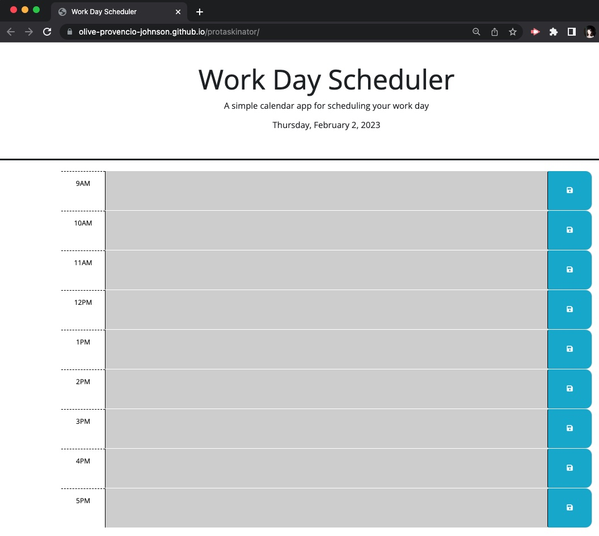

# Protaskinator
The protaskinator is a simple calendar application that allows a user to save events for each hour of the day. The style of the hour blocks are dynamically changed throughout the day, using dayjs, to help signal whether an event is in the past, present, or future. The past is reflected in grey, the present in red, and the future in green. Any input is saved in local storgage, and will stay reflected on the page, even after the page is closed or navigated away from. When the user returns to the page, any past input will still be reflected on the page. This app runs in a web browser and features dynamically updated HTML and CSS powered by jQuery, boostrap, and the Day.js API. 

## Screenshot
The following image demonstrates the web application's appearance and functionality:

## Application Link
[Link to live webpage](https://olive-provencio-johnson.github.io/protaskinator/)

